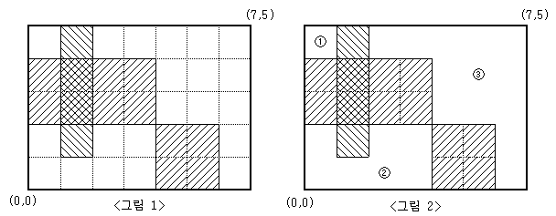

# 문제 목록

- ### [그룹 단어 체커 - 1316](#boj1316)<br/>
- ### [영역 구하기 - 2583](#boj2583)<br/>
- ### [사탕 게임 - 3085](#boj3085)

<br/>

<br/>

# BOJ1316

##  [그룹 단어 체크](https://www.acmicpc.net/problem/1316)

| 시간 제한 | 메모리 제한 |
| :-------: | :---------: |
|   2 초    |   128 MB    |

### 분류

- 구현
- 문자열

### 문제 설명

그룹 단어란 단어에 존재하는 모든 문자에 대해서, 각 문자가 연속해서 나타나는 경우만을 말한다. 예를 들면, ccazzzzbb는 c, a, z, b가 모두 연속해서 나타나고, kin도 k, i, n이 연속해서 나타나기 때문에 그룹 단어이지만, aabbbccb는 b가 떨어져서 나타나기 때문에 그룹 단어가 아니다.

단어 N개를 입력으로 받아 그룹 단어의 개수를 출력하는 프로그램을 작성하시오.

### 입력

첫째 줄에 단어의 개수 N이 들어온다. N은 100보다 작거나 같은 자연수이다. 둘째 줄부터 N개의 줄에 단어가 들어온다. 단어는 알파벳 소문자로만 되어있고 중복되지 않으며, 길이는 최대 100이다.

### 출력

첫째 줄에 그룹 단어의 개수를 출력한다.

### 예제 입력 1

```
3
happy
new
year
```

### 예제 출력 1

```
3
```

### 예제 입력 2

```
4
aba
abab
abcabc
a
```

### 예제 출력 2

```
1
```

### 예제 입력 3

```
5
ab
aa
aca
ba
bb
```

### 예제 출력 3

```
4
```

### 예제 입력 4

```
2
yzyzy
zyzyz
```

### 예제 출력 4

```
0
```

### 예제 입력 5

```
1
z
```

### 예제 출력 5

```
1
```

<br/>
<br/>

---

<br/>
<br/>

# BOJ2583

##  [영역 구하기](https://www.acmicpc.net/problem/2583)

| 시간 제한 | 메모리 제한 |
| :-------: | :---------: |
|   1 초    |   128 MB    |

### 분류

- 그래프 이론
- 그래프 탐색
- 너비 우선 탐색
- 깊이 우선 탐색

### 문제 설명

금의 간격이 1인 M×N(M,N≤100)크기의 모눈종이가 있다. 이 모눈종이 위에 눈금에 맞추어 K개의 직사각형을 그릴 때, 이들 K개의 직사각형의 내부를 제외한 나머지 부분이 몇 개의 분리된 영역으로 나누어진다.

예를 들어 M=5, N=7 인 모눈종이 위에 <그림 1>과 같이 직사각형 3개를 그렸다면, 그 나머지 영역은 <그림 2>와 같이 3개의 분리된 영역으로 나누어지게 된다.



<그림 2>와 같이 분리된 세 영역의 넓이는 각각 1, 7, 13이 된다.

M, N과 K 그리고 K개의 직사각형의 좌표가 주어질 때, K개의 직사각형 내부를 제외한 나머지 부분이 몇 개의 분리된 영역으로 나누어지는지, 그리고 분리된 각 영역의 넓이가 얼마인지를 구하여 이를 출력하는 프로그램을 작성하시오.

### 입력

첫째 줄에 M과 N, 그리고 K가 빈칸을 사이에 두고 차례로 주어진다. M, N, K는 모두 100 이하의 자연수이다. 둘째 줄부터 K개의 줄에는 한 줄에 하나씩 직사각형의 왼쪽 아래 꼭짓점의 x, y좌표값과 오른쪽 위 꼭짓점의 x, y좌표값이 빈칸을 사이에 두고 차례로 주어진다. 모눈종이의 왼쪽 아래 꼭짓점의 좌표는 (0,0)이고, 오른쪽 위 꼭짓점의 좌표는(N,M)이다. 입력되는 K개의 직사각형들이 모눈종이 전체를 채우는 경우는 없다.

### 출력

첫째 줄에 분리되어 나누어지는 영역의 개수를 출력한다. 둘째 줄에는 각 영역의 넓이를 오름차순으로 정렬하여 빈칸을 사이에 두고 출력한다.

### 예제 입력 1

```
5 7 3
0 2 4 4
1 1 2 5
4 0 6 2
```

### 예제 출력 1

```
3
1 7 13
```

<br/>
<br/>

---

<br/>
<br/>

# BOJ3085

## [사탕 게임](https://www.acmicpc.net/problem/3085)

| 시간 제한 | 메모리 제한 |
| :-------: | :---------: |
|   10 초   |   128 MB    |

### 분류

- 브루트포스 알고리즘
- 백트래킹

### 문제 설명

상근이는 어렸을 적에 "봄보니 (Bomboni)" 게임을 즐겨했다.

가장 처음에 N×N크기에 사탕을 채워 놓는다. 사탕의 색은 모두 같지 않을 수도 있다. 상근이는 사탕의 색이 다른 인접한 두 칸을 고른다. 그 다음 고른 칸에 들어있는 사탕을 서로 교환한다. 이제, 모두 같은 색으로 이루어져 있는 가장 긴 연속 부분(행 또는 열)을 고른 다음 그 사탕을 모두 먹는다.

사탕이 채워진 상태가 주어졌을 때, 상근이가 먹을 수 있는 사탕의 최대 개수를 구하는 프로그램을 작성하시오.

### 입력

첫째 줄에 보드의 크기 N이 주어진다. (3 ≤ N ≤ 50)

다음 N개 줄에는 보드에 채워져 있는 사탕의 색상이 주어진다. 빨간색은 C, 파란색은 P, 초록색은 Z, 노란색은 Y로 주어진다.

사탕의 색이 다른 인접한 두 칸이 존재하는 입력만 주어진다.

### 출력

첫째 줄에 상근이가 먹을 수 있는 사탕의 최대 개수를 출력한다.

### 예제 입력 1

```
3
CCP
CCP
PPC
```

### 예제 출력 1

```
3
```

### 예제 입력 2

```
4
PPPP
CYZY
CCPY
PPCC
```

### 예제 출력 2

```
4
```

### 예제 입력 3

```
5
YCPZY
CYZZP
CCPPP
YCYZC
CPPZZ
```

### 예제 출력 3

```
4
```
