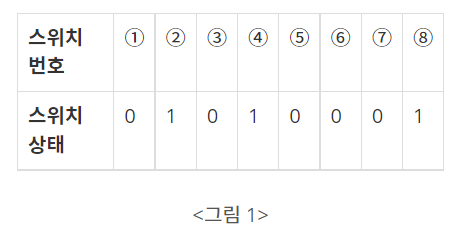
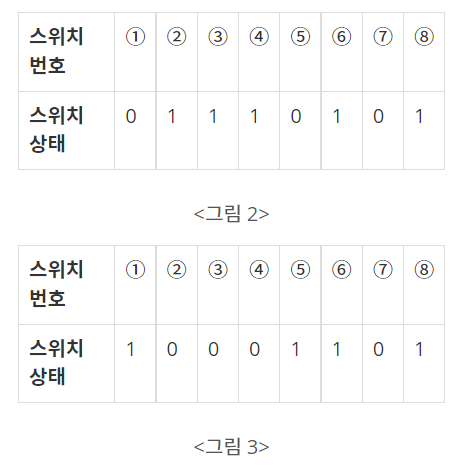

# 문제 목록

- ### [행렬 - 1080](#boj1080)<br/>
- ### [스위치 켜고 끄기 - 1244](#boj1244)<br/>
- ### [예산 - 2512](#boj2512)

<br/>

<br/>

# BOJ1080

##  [행렬]](https://www.acmicpc.net/problem/1080)

| 시간 제한 | 메모리 제한 |
| :-------: | :---------: |
|   2 초    |   128 MB    |

### 분류

- 그리디 알고리즘

### 문제 설명

0과 1로만 이루어진 행렬 A와 행렬 B가 있다. 이때, 행렬 A를 행렬 B로 바꾸는데 필요한 연산의 횟수의 최솟값을 구하는 프로그램을 작성하시오.

행렬을 변환하는 연산은 어떤 3×3크기의 부분 행렬에 있는 모든 원소를 뒤집는 것이다. (0 → 1, 1 → 0)

### 입력

첫째 줄에 행렬의 크기 N M이 주어진다. N과 M은 50보다 작거나 같은 자연수이다. 둘째 줄부터 N개의 줄에는 행렬 A가 주어지고, 그 다음줄부터 N개의 줄에는 행렬 B가 주어진다.

### 출력

첫째 줄에 문제의 정답을 출력한다. 만약 A를 B로 바꿀 수 없다면 -1을 출력한다.

### 예제 입력 1

```
3 4
0000
0010
0000
1001
1011
1001
```

### 예제 출력 1

```
2
```

### 예제 입력 2

```
3 3
111
111
111
000
000
000
```

### 예제 출력 2

```
1
```

### 예제 입력 3

```
1 1
1
0
```

### 예제 출력 3

```
-1
```

### 예제 입력 4

```
18 3
001
100
100
000
011
010
100
100
010
010
010
110
101
101
000
110
000
110
001
100
011
000
100
010
011
100
101
101
010
001
010
010
111
110
111
001
```

### 예제 출력 4

```
7
```

<br/>
<br/>

---

<br/>
<br/>

# BOJ1244

##  [스위치 켜고 끄기](https://www.acmicpc.net/problem/1244)

| 시간 제한 | 메모리 제한 |
| :-------: | :---------: |
|   2 초    |   128 MB    |

### 분류

- 구현
- 시뮬레이션

### 문제 설명

1부터 연속적으로 번호가 붙어있는 스위치들이 있다. 스위치는 켜져 있거나 꺼져있는 상태이다. <그림 1>에 스위치 8개의 상태가 표시되어 있다. ‘1’은 스위치가 켜져 있음을, ‘0’은 꺼져 있음을 나타낸다. 그리고 학생 몇 명을 뽑아서, 학생들에게 1 이상이고 스위치 개수 이하인 자연수를 하나씩 나누어주었다. 학생들은 자신의 성별과 받은 수에 따라 아래와 같은 방식으로 스위치를 조작하게 된다.

남학생은 스위치 번호가 자기가 받은 수의 배수이면, 그 스위치의 상태를 바꾼다. 즉, 스위치가 켜져 있으면 끄고, 꺼져 있으면 켠다. <그림 1>과 같은 상태에서 남학생이 3을 받았다면, 이 학생은 <그림 2>와 같이 3번, 6번 스위치의 상태를 바꾼다.

여학생은 자기가 받은 수와 같은 번호가 붙은 스위치를 중심으로 좌우가 대칭이면서 가장 많은 스위치를 포함하는 구간을 찾아서, 그 구간에 속한 스위치의 상태를 모두 바꾼다. 이때 구간에 속한 스위치 개수는 항상 홀수가 된다.



예를 들어 <그림 2>에서 여학생이 3을 받았다면, 3번 스위치를 중심으로 2번, 4번 스위치의 상태가 같고 1번, 5번 스위치의 상태가 같으므로, <그림 3>과 같이 1번부터 5번까지 스위치의 상태를 모두 바꾼다. 만약 <그림 2>에서 여학생이 4를 받았다면, 3번, 5번 스위치의 상태가 서로 다르므로 4번 스위치의 상태만 바꾼다.



입력으로 스위치들의 처음 상태가 주어지고, 각 학생의 성별과 받은 수가 주어진다. 학생들은 입력되는 순서대로 자기의 성별과 받은 수에 따라 스위치의 상태를 바꾸었을 때, 스위치들의 마지막 상태를 출력하는 프로그램을 작성하시오.

### 입력

첫째 줄에는 스위치 개수가 주어진다. 스위치 개수는 100 이하인 양의 정수이다. 둘째 줄에는 각 스위치의 상태가 주어진다. 켜져 있으면 1, 꺼져있으면 0이라고 표시하고 사이에 빈칸이 하나씩 있다. 셋째 줄에는 학생수가 주어진다. 학생수는 100 이하인 양의 정수이다. 넷째 줄부터 마지막 줄까지 한 줄에 한 학생의 성별, 학생이 받은 수가 주어진다. 남학생은 1로, 여학생은 2로 표시하고, 학생이 받은 수는 스위치 개수 이하인 양의 정수이다. 학생의 성별과 받은 수 사이에 빈칸이 하나씩 있다.

### 출력

스위치의 상태를 1번 스위치에서 시작하여 마지막 스위치까지 한 줄에 20개씩 출력한다. 예를 들어 21번 스위치가 있다면 이 스위치의 상태는 둘째 줄 맨 앞에 출력한다. 켜진 스위치는 1, 꺼진 스위치는 0으로 표시하고, 스위치 상태 사이에 빈칸을 하나씩 둔다.

### 예제 입력 1

```
8
0 1 0 1 0 0 0 1
2
1 3
2 3
```

### 예제 출력 1

```
1 0 0 0 1 1 0 1
```

<br/>
<br/>

---

<br/>
<br/>

# BOJ2512

## [예산](https://www.acmicpc.net/problem/2512)

| 시간 제한 | 메모리 제한 |
| :-------: | :---------: |
|   1 초    |   128 MB    |

### 분류

- 이분 탐색
- 매개 변수 탐색

### 문제 설명

국가의 역할 중 하나는 여러 지방의 예산요청을 심사하여 국가의 예산을 분배하는 것이다. 국가예산의 총액은 미리 정해져 있어서 모든 예산요청을 배정해 주기는 어려울 수도 있다. 그래서 정해진 총액 이하에서 가능한 한 최대의 총 예산을 다음과 같은 방법으로 배정한다.

1. 모든 요청이 배정될 수 있는 경우에는 요청한 금액을 그대로 배정한다.
2. 모든 요청이 배정될 수 없는 경우에는 특정한 정수 상한액을 계산하여 그 이상인 예산요청에는 모두 상한액을 배정한다. 상한액 이하의 예산요청에 대해서는 요청한 금액을 그대로 배정한다.

예를 들어, 전체 국가예산이 485이고 4개 지방의 예산요청이 각각 120, 110, 140, 150이라고 하자. 이 경우, 상한액을 127로 잡으면, 위의 요청들에 대해서 각각 120, 110, 127, 127을 배정하고 그 합이 484로 가능한 최대가 된다.

여러 지방의 예산요청과 국가예산의 총액이 주어졌을 때, 위의 조건을 모두 만족하도록 예산을 배정하는 프로그램을 작성하시오.

### 입력

첫째 줄에는 지방의 수를 의미하는 정수 N이 주어진다. N은 3 이상 10,000 이하이다. 다음 줄에는 각 지방의 예산요청을 표현하는 N개의 정수가 빈칸을 사이에 두고 주어진다. 이 값들은 모두 1 이상 100,000 이하이다. 그 다음 줄에는 총 예산을 나타내는 정수 M이 주어진다. M은 N 이상 1,000,000,000 이하이다.

### 출력

첫째 줄에는 배정된 예산들 중 최댓값인 정수를 출력한다.

### 예제 입력 1

```
4
120 110 140 150
485
```

### 예제 출력 1

```
127
```

### 예제 입력 2

```
5
70 80 30 40 100
450
```

### 예제 출력 2

```
100
```
