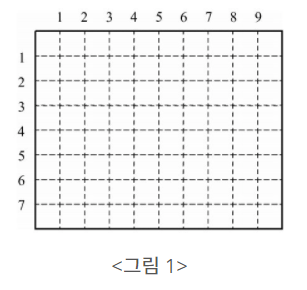
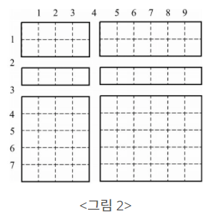
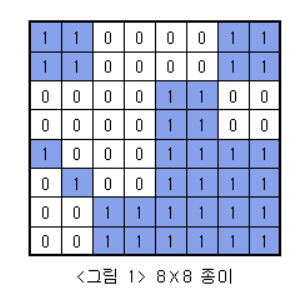
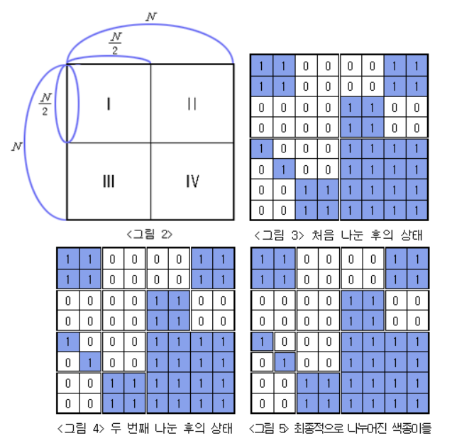

# 문제 목록

- ### [N과 M (1) - 15649](#boj15649)<br/>
- ### [종이자르기 - 2628](#boj2628)<br/>
- ### [색종이 만들기 - 2630](#boj2630)

<br/>

<br/>

# BOJ15649

##  [N과 M (1)](https://www.acmicpc.net/problem/15649)

| 시간 제한 | 메모리 제한 |
| :-------: | :---------: |
|   1 초    |   512 MB    |

### 분류

- 백트래킹

### 문제 설명

자연수 N과 M이 주어졌을 때, 아래 조건을 만족하는 길이가 M인 수열을 모두 구하는 프로그램을 작성하시오.

-1부터 N까지 자연수 중에서 중복 없이 M개를 고른 수열

### 입력

첫째 줄에 자연수 N과 M이 주어진다. (1 ≤ M ≤ N ≤ 8)

### 출력

한 줄에 하나씩 문제의 조건을 만족하는 수열을 출력한다. 중복되는 수열을 여러 번 출력하면 안되며, 각 수열은 공백으로 구분해서 출력해야 한다.

수열은 사전 순으로 증가하는 순서로 출력해야 한다.

### 예제 입력 1

```
3 1
```

### 예제 출력 1

```
1
2
3
```

### 예제 입력 2

```
4 2
```

### 예제 출력 2

```
1 2
1 3
1 4
2 1
2 3
2 4
3 1
3 2
3 4
4 1
4 2
4 3
```

### 예제 입력 3

```
4 4
```

### 예제 출력 3

```
1 2 3 4
1 2 4 3
1 3 2 4
1 3 4 2
1 4 2 3
1 4 3 2
2 1 3 4
2 1 4 3
2 3 1 4
2 3 4 1
2 4 1 3
2 4 3 1
3 1 2 4
3 1 4 2
3 2 1 4
3 2 4 1
3 4 1 2
3 4 2 1
4 1 2 3
4 1 3 2
4 2 1 3
4 2 3 1
4 3 1 2
4 3 2 1
```

<br/>
<br/>

---

<br/>
<br/>

# BOJ2628

##  [종이자르기](https://www.acmicpc.net/problem/2628)

| 시간 제한 | 메모리 제한 |
| :-------: | :---------: |
|   1 초    |   128 MB    |

### 분류

- 정렬

### 문제 설명

아래 <그림 1>과 같이 직사각형 모양의 종이가 있다. 이 종이는 가로방향과 세로 방향으로 1㎝마다 점선이 그어져 있다. 가로 점선은 위에서 아래로 1번부터 차례로 번호가 붙어 있고, 세로 점선은 왼쪽에서 오른쪽으로 번호가 붙어 있다.



점선을 따라 이 종이를 칼로 자르려고 한다. 가로 점선을 따라 자르는 경우는 종이의 왼쪽 끝에서 오른쪽 끝까지, 세로 점선인 경우는 위쪽 끝에서 아래쪽 끝까지 한 번에 자른다. 예를 들어, <그림 1>의 가로 길이 10㎝이고 세로 길이 8㎝인 종이를 3번 가로 점선, 4번 세로 점선, 그리고 2번 가로 점선을 따라 자르면 <그림 2>와 같이 여러 개의 종이 조각으로 나뉘게 된다. 이때 가장 큰 종이 조각의 넓이는 30㎠이다.



입력으로 종이의 가로 세로 길이, 그리고 잘라야할 점선들이 주어질 때, 가장 큰 종이 조각의 넓이가 몇 ㎠인지를 구하는 프로그램을 작성하시오.

### 입력

첫줄에는 종이의 가로와 세로의 길이가 차례로 자연수로 주어진다. 가로와 세로의 길이는 최대 100㎝이다. 둘째 줄에는 칼로 잘라야하는 점선의 개수가 주어진다. 셋째 줄부터 마지막 줄까지 한 줄에 점선이 하나씩 아래와 같은 방법으로 입력된다. 가로로 자르는 점선은 0과 점선 번호가 차례로 주어지고, 세로로 자르는 점선은 1과 점선 번호가 주어진다. 입력되는 두 숫자 사이에는 빈 칸이 하나씩 있다.

### 출력

첫째 줄에 가장 큰 종이 조각의 넓이를 출력한다. 단, 넓이의 단위는 출력하지 않는다.

### 예제 입력 1

```
10 8
3
0 3
1 4
0 2
```

### 예제 출력 1

```
30
```

<br/>
<br/>

---

<br/>
<br/>

# BOJ2630

## [색종이 만들기](https://www.acmicpc.net/problem/2630)

| 시간 제한 | 메모리 제한 |
| :-------: | :---------: |
|   1 초    |   128 MB    |

### 분류

- 분할 정복
- 재귀

### 문제 설명

아래 <그림 1>과 같이 여러개의 정사각형칸들로 이루어진 정사각형 모양의 종이가 주어져 있고, 각 정사각형들은 하얀색으로 칠해져 있거나 파란색으로 칠해져 있다. 주어진 종이를 일정한 규칙에 따라 잘라서 다양한 크기를 가진 정사각형 모양의 하얀색 또는 파란색 색종이를 만들려고 한다.



전체 종이의 크기가 N×N(N=2k, k는 1 이상 7 이하의 자연수) 이라면 종이를 자르는 규칙은 다음과 같다.

전체 종이가 모두 같은 색으로 칠해져 있지 않으면 가로와 세로로 중간 부분을 잘라서 <그림 2>의 I, II, III, IV와 같이 똑같은 크기의 네 개의 N/2 × N/2색종이로 나눈다. 나누어진 종이 I, II, III, IV 각각에 대해서도 앞에서와 마찬가지로 모두 같은 색으로 칠해져 있지 않으면 같은 방법으로 똑같은 크기의 네 개의 색종이로 나눈다. 이와 같은 과정을 잘라진 종이가 모두 하얀색 또는 모두 파란색으로 칠해져 있거나, 하나의 정사각형 칸이 되어 더 이상 자를 수 없을 때까지 반복한다.

위와 같은 규칙에 따라 잘랐을 때 <그림 3>은 <그림 1>의 종이를 처음 나눈 후의 상태를, <그림 4>는 두 번째 나눈 후의 상태를, <그림 5>는 최종적으로 만들어진 다양한 크기의 9장의 하얀색 색종이와 7장의 파란색 색종이를 보여주고 있다.



입력으로 주어진 종이의 한 변의 길이 N과 각 정사각형칸의 색(하얀색 또는 파란색)이 주어질 때 잘라진 하얀색 색종이와 파란색 색종이의 개수를 구하는 프로그램을 작성하시오.

### 입력

첫째 줄에는 전체 종이의 한 변의 길이 N이 주어져 있다. N은 2, 4, 8, 16, 32, 64, 128 중 하나이다. 색종이의 각 가로줄의 정사각형칸들의 색이 윗줄부터 차례로 둘째 줄부터 마지막 줄까지 주어진다. 하얀색으로 칠해진 칸은 0, 파란색으로 칠해진 칸은 1로 주어지며, 각 숫자 사이에는 빈칸이 하나씩 있다.

### 출력

첫째 줄에는 잘라진 햐얀색 색종이의 개수를 출력하고, 둘째 줄에는 파란색 색종이의 개수를 출력한다.

### 예제 입력 1

```
8
1 1 0 0 0 0 1 1
1 1 0 0 0 0 1 1
0 0 0 0 1 1 0 0
0 0 0 0 1 1 0 0
1 0 0 0 1 1 1 1
0 1 0 0 1 1 1 1
0 0 1 1 1 1 1 1
0 0 1 1 1 1 1 1
```

### 예제 출력 1

```
9
7
```
