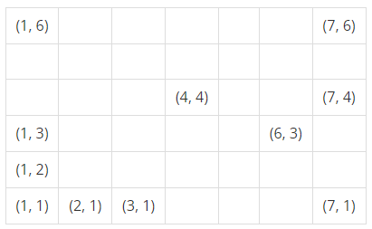
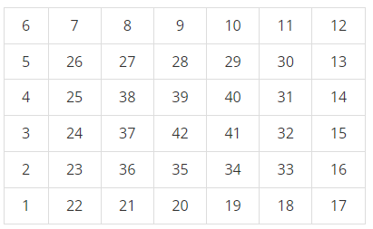
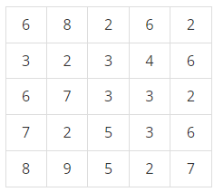
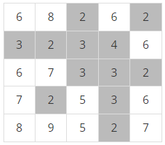
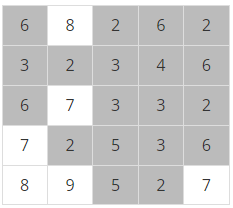
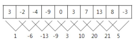
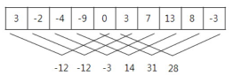

# 문제 목록

- ### [자리 배정 - 10157](#boj10157)<br/>
- ### [안전 영역 - 2468](#boj2468)<br/>
- ### [수열 - 2559](#boj2559)

<br/>

<br/>

# BOJ10157

##  [자리 배정](https://www.acmicpc.net/problem/10157)

| 시간 제한 | 메모리 제한 |
| :-------: | :---------: |
|   1 초    |   256 MB    |

### 분류

- 구현

### 문제 설명

어떤 공연장에는 가로로 C개, 세로로 R개의 좌석이 C×R격자형으로 배치되어 있다. 각 좌석의 번호는 해당 격자의 좌표 (x,y)로 표시된다.

예를 들어보자. 아래 그림은 가로 7개, 세로 6개 좌석으로 구성된 7×6격자형 좌석배치를 보여주고 있다. 그림에서 각 단위 사각형은 개별 좌석을 나타내며, 그 안에 표시된 값 (x,y)는 해당 좌석의 번호를 나타낸다. 가장 왼쪽 아래의 좌석번호는 (1,1)이며, 가장 오른쪽 위 좌석의 번호는 (7,6)이다.



이 공연장에 입장하기 위하여 많은 사람이 대기줄에 서있다. 기다리고 있는 사람들은 제일 앞에서부터 1, 2, 3, 4, . 순으로 대기번호표를 받았다. 우리는 대기번호를 가진 사람들에 대하여 (1,1)위치 좌석부터 시작하여 시계방향으로 돌아가면서 비어있는 좌석에 관객을 순서대로 배정한다. 이것을 좀 더 구체적으로 설명하면 다음과 같다.

먼저 첫 번째 사람, 즉 대기번호 1인 사람은 자리 (1,1)에 배정한다. 그 다음에는 위쪽 방향의 좌석으로 올라가면서 다음 사람들을 배정한다. 만일 더 이상 위쪽 방향으로 빈 좌석이 없으면 오른쪽으로 가면서 배정한다. 오른쪽에 더 이상 빈자리가 없으면 아래쪽으로 내려간다. 그리고 아래쪽에 더 이상 자리가 없으면 왼쪽으로 가면서 남은 빈 좌석을 배정한다. 이 후 왼쪽으로 더 이상의 빈 좌석이 없으면 다시 위쪽으로 배정하고, 이 과정을 모든 좌석이 배정될 때까지 반복한다.

아래 그림은 7×6공연장에서 대기번호 1번부터 42번까지의 관객이 좌석에 배정된 결과를 보여주고 있다.



여러분은 공연장의 크기를 나타내는 자연수 C와 R이 주어져 있을 때, 대기 순서가 K인 관객에게 배정될 좌석 번호 (x,y)를 찾는 프로그램을 작성해야 한다.

### 입력

첫 줄에는 공연장의 격자 크기를 나타내는 정수 C와 R이 하나의 공백을 사이에 두고 차례대로 주어진다. 두 값의 범위는 5 ≤ C, R ≤ 1,000이다. 그 다음 줄에는 어떤 관객의 대기번호 K가 주어진다. 단 1 ≤ K ≤ 100,000,000이다.

### 출력

입력으로 제시된 대기번호 K인 관객에게 배정될 좌석번호 (x,y)를 구해서 두 값, x와 y를 하나의 공백을 사이에 두고 출력해야 한다. 만일 모든 좌석이 배정되어 해당 대기번호의 관객에게 좌석을 배정할 수 없는 경우에는 0(숫자 영)을 출력해야 한다.

### 예제 입력 1

```
7 6
11
```

### 예제 출력 1

```
6 6
```

### 예제 입력 2

```
7 6
87
```

### 예제 출력 2

```
0
```

### 예제 입력 3

```
100 100
3000
```

### 예제 출력 3

```
9 64
```

<br/>
<br/>

---

<br/>
<br/>

# BOJ2468

##  [안전 영역](https://www.acmicpc.net/problem/2468)

| 시간 제한 | 메모리 제한 |
| :-------: | :---------: |
|   1 초    |   128 MB    |

### 분류

- 그래프 이론
- 브루트포스 알고리즘
- 그래프 탐색
- 너비 우선 탐색
- 깊이 우선 탐색

### 문제 설명

재난방재청에서는 많은 비가 내리는 장마철에 대비해서 다음과 같은 일을 계획하고 있다. 먼저 어떤 지역의 높이 정보를 파악한다. 그 다음에 그 지역에 많은 비가 내렸을 때 물에 잠기지 않는 안전한 영역이 최대로 몇 개가 만들어 지는 지를 조사하려고 한다. 이때, 문제를 간단하게 하기 위하여, 장마철에 내리는 비의 양에 따라 일정한 높이 이하의 모든 지점은 물에 잠긴다고 가정한다.

어떤 지역의 높이 정보는 행과 열의 크기가 각각 N인 2차원 배열 형태로 주어지며 배열의 각 원소는 해당 지점의 높이를 표시하는 자연수이다. 예를 들어, 다음은 N=5인 지역의 높이 정보이다.



이제 위와 같은 지역에 많은 비가 내려서 높이가 4 이하인 모든 지점이 물에 잠겼다고 하자. 이 경우에 물에 잠기는 지점을 회색으로 표시하면 다음과 같다.



물에 잠기지 않는 안전한 영역이라 함은 물에 잠기지 않는 지점들이 위, 아래, 오른쪽 혹은 왼쪽으로 인접해 있으며 그 크기가 최대인 영역을 말한다. 위의 경우에서 물에 잠기지 않는 안전한 영역은 5개가 된다(꼭짓점으로만 붙어 있는 두 지점은 인접하지 않는다고 취급한다).

또한 위와 같은 지역에서 높이가 6이하인 지점을 모두 잠기게 만드는 많은 비가 내리면 물에 잠기지 않는 안전한 영역은 아래 그림에서와 같이 네 개가 됨을 확인할 수 있다.



이와 같이 장마철에 내리는 비의 양에 따라서 물에 잠기지 않는 안전한 영역의 개수는 다르게 된다. 위의 예와 같은 지역에서 내리는 비의 양에 따른 모든 경우를 다 조사해 보면 물에 잠기지 않는 안전한 영역의 개수 중에서 최대인 경우는 5임을 알 수 있다.

어떤 지역의 높이 정보가 주어졌을 때, 장마철에 물에 잠기지 않는 안전한 영역의 최대 개수를 계산하는 프로그램을 작성하시오.

### 입력

첫째 줄에는 어떤 지역을 나타내는 2차원 배열의 행과 열의 개수를 나타내는 수 N이 입력된다. N은 2 이상 100 이하의 정수이다. 둘째 줄부터 N개의 각 줄에는 2차원 배열의 첫 번째 행부터 N번째 행까지 순서대로 한 행씩 높이 정보가 입력된다. 각 줄에는 각 행의 첫 번째 열부터 N번째 열까지 N개의 높이 정보를 나타내는 자연수가 빈 칸을 사이에 두고 입력된다. 높이는 1이상 100 이하의 정수이다.

### 출력

첫째 줄에 장마철에 물에 잠기지 않는 안전한 영역의 최대 개수를 출력한다.

### 예제 입력 1

```
5
6 8 2 6 2
3 2 3 4 6
6 7 3 3 2
7 2 5 3 6
8 9 5 2 7
```

### 예제 출력 1

```
5
```

### 예제 입력 2

```
7
9 9 9 9 9 9 9
9 2 1 2 1 2 9
9 1 8 7 8 1 9
9 2 7 9 7 2 9
9 1 8 7 8 1 9
9 2 1 2 1 2 9
9 9 9 9 9 9 9
```

### 예제 출력 2

```
6
```

<br/>
<br/>

---

<br/>
<br/>

# BOJ2559

## [수열](https://www.acmicpc.net/problem/2559)

| 시간 제한 | 메모리 제한 |
| :-------: | :---------: |
|   1 초    |   128 MB    |

### 분류

- 누적 합
- 두 포인터
- 슬라이딩 윈도우

### 문제 설명

매일 아침 9시에 학교에서 측정한 온도가 어떤 정수의 수열로 주어졌을 때, 연속적인 며칠 동안의 온도의 합이 가장 큰 값을 알아보고자 한다.

예를 들어, 아래와 같이 10일 간의 온도가 주어졌을 때,

3 -2 -4 -9 0 3 7 13 8 -3

모든 연속적인 이틀간의 온도의 합은 아래와 같다.



이때, 온도의 합이 가장 큰 값은 21이다.

또 다른 예로 위와 같은 온도가 주어졌을 때, 모든 연속적인 5일 간의 온도의 합은 아래와 같으며,



이때, 온도의 합이 가장 큰 값은 31이다.

매일 측정한 온도가 정수의 수열로 주어졌을 때, 연속적인 며칠 동안의 온도의 합이 가장 큰 값을 계산하는 프로그램을 작성하시오.

### 입력

첫째 줄에는 두 개의 정수 N과 K가 한 개의 공백을 사이에 두고 순서대로 주어진다. 첫 번째 정수 N은 온도를 측정한 전체 날짜의 수이다. N은 2 이상 100,000 이하이다. 두 번째 정수 K는 합을 구하기 위한 연속적인 날짜의 수이다. K는 1과 N 사이의 정수이다. 둘째 줄에는 매일 측정한 온도를 나타내는 N개의 정수가 빈칸을 사이에 두고 주어진다. 이 수들은 모두 -100 이상 100 이하이다.

### 출력

첫째 줄에는 입력되는 온도의 수열에서 연속적인 K일의 온도의 합이 최대가 되는 값을 출력한다.

### 예제 입력 1

```
10 2
3 -2 -4 -9 0 3 7 13 8 -3
```

### 예제 출력 1

```
21
```

### 예제 입력 2

```
10 5
3 -2 -4 -9 0 3 7 13 8 -3
```

### 예제 출력 2

```
31
```
