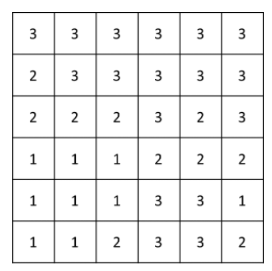
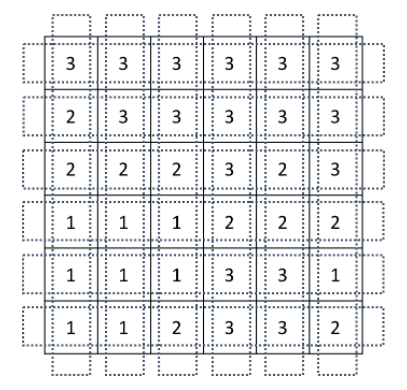
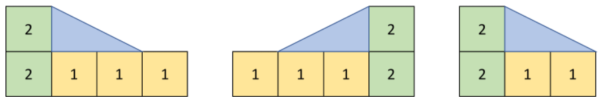
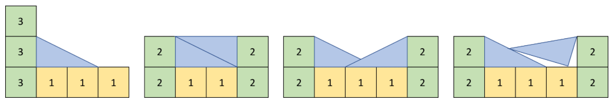
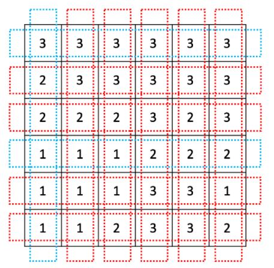
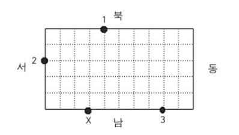

# 문제 목록

- ### [경사로 - 14890](#boj14890)<br/>
- ### [경비원 - 2564](#boj2564)<br/>
- ### [빙고 - 2578](#boj2578)

<br/>

<br/>

# BOJ14890

##  [경사로](https://www.acmicpc.net/problem/14890)

| 시간 제한 | 메모리 제한 |
| :-------: | :---------: |
|   2 초    |   512 MB    |

### 분류

- 구현

### 문제 설명

크기가 N×N인 지도가 있다. 지도의 각 칸에는 그 곳의 높이가 적혀져 있다.

오늘은 이 지도에서 지나갈 수 있는 길이 몇 개 있는지 알아보려고 한다. 길이란 한 행 또는 한 열 전부를 나타내며, 한쪽 끝에서 다른쪽 끝까지 지나가는 것이다.

다음과 같은 N=6인 경우 지도를 살펴보자.



이때, 길은 총 2N개가 있으며, 아래와 같다.



길을 지나갈 수 있으려면 길에 속한 모든 칸의 높이가 모두 같아야 한다. 또는, 경사로를 놓아서 지나갈 수 있는 길을 만들 수 있다. 경사로는 높이가 항상 1이며, 길이는 L이다. 또, 개수는 매우 많아 부족할 일이 없다. 경사로는 낮은 칸과 높은 칸을 연결하며, 아래와 같은 조건을 만족해야한다.

- 경사로는 낮은 칸에 놓으며, L개의 연속된 칸에 경사로의 바닥이 모두 접해야 한다.
- 낮은 칸과 높은 칸의 높이 차이는 1이어야 한다.
- 경사로를 놓을 낮은 칸의 높이는 모두 같아야 하고, L개의 칸이 연속되어 있어야 한다.

아래와 같은 경우에는 경사로를 놓을 수 없다.

- 경사로를 놓은 곳에 또 경사로를 놓는 경우
- 낮은 칸과 높은 칸의 높이 차이가 1이 아닌 경우
- 낮은 지점의 칸의 높이가 모두 같지 않거나, L개가 연속되지 않은 경우
- 경사로를 놓다가 범위를 벗어나는 경우

L = 2인 경우에 경사로를 놓을 수 있는 경우를 그림으로 나타내면 아래와 같다.



경사로를 놓을 수 없는 경우는 아래와 같다.



위의 그림의 가장 왼쪽부터 1번, 2번, 3번, 4번 예제라고 했을 때, 1번은 높이 차이가 1이 아니라서, 2번은 경사로를 바닥과 접하게 놓지 않아서, 3번은 겹쳐서 놓아서, 4번은 기울이게 놓아서 불가능한 경우이다.

가장 위에 주어진 그림 예의 경우에 지나갈 수 있는 길은 파란색으로, 지나갈 수 없는 길은 빨간색으로 표시되어 있으며, 아래와 같다. 경사로의 길이 L = 2이다.



지도가 주어졌을 때, 지나갈 수 있는 길의 개수를 구하는 프로그램을 작성하시오.

### 입력

첫째 줄에 N (2 ≤ N ≤ 100)과 L (1 ≤ L ≤ N)이 주어진다. 둘째 줄부터 N개의 줄에 지도가 주어진다. 각 칸의 높이는 10보다 작거나 같은 자연수이다.

### 출력

첫째 줄에 지나갈 수 있는 길의 개수를 출력한다.

### 예제 입력 1

```
6 2
3 3 3 3 3 3
2 3 3 3 3 3
2 2 2 3 2 3
1 1 1 2 2 2
1 1 1 3 3 1
1 1 2 3 3 2
```

### 예제 출력 1

```
3
```

### 예제 입력 2

```
6 2
3 2 1 1 2 3
3 2 2 1 2 3
3 2 2 2 3 3
3 3 3 3 3 3
3 3 3 3 2 2
3 3 3 3 2 2
```

### 예제 출력 2

```
7
```

### 예제 입력 3

```
6 3
3 2 1 1 2 3
3 2 2 1 2 3
3 2 2 2 3 3
3 3 3 3 3 3
3 3 3 3 2 2
3 3 3 3 2 2
```

### 예제 출력 3

```
3
```

### 예제 입력 4

```
6 1
3 2 1 1 2 3
3 2 2 1 2 3
3 2 2 2 3 3
3 3 3 3 3 3
3 3 3 3 2 2
3 3 3 3 2 2
```

### 예제 출력 4

```
11
```

<br/>
<br/>

---

<br/>
<br/>

# BOJ2564

##  [경비원](https://www.acmicpc.net/problem/2564)

| 시간 제한 | 메모리 제한 |
| :-------: | :---------: |
|   1 초    |   128 MB    |

### 분류

- 구현
- 많은 조건 분기

### 문제 설명

동근이는 무인 경비 회사 경비원으로 항상 대기하고 있다가 호출이 들어오면 경비차를 몰고 그 곳으로 달려가야 한다. 동근이가 담당하고 있는 곳은 직사각형 모양의 블록으로 블록 중간을 가로질러 차가 통과할만한 길이 없다. 이 블록 경계에 무인 경비를 의뢰한 상점들이 있다.

예를 들어 가로의 길이가 10, 세로의 길이가 5인 블록의 경계에 무인 경비를 의뢰한 3개의 상점이 있다고 하자. <그림 1>과 같이 이들은 1, 2, 3으로 표시되어 있고, 동근이는 X로 표시한 위치에 있다.



1번 상점에서 호출이 들어 왔을 때 동근이가 블록을 시계방향으로 돌아 이동하면 이동 거리가 12가 된다. 반면 반시계방향으로 돌아 이동하면 이동 거리는 18이 된다. 따라서 동근이가 1번 상점으로 가는 최단 거리는 12가 된다. 마찬가지로 동근이의 위치에서 2번 상점까지의 최단 거리는 6, 3번 상점까지의 최단 거리는 5가 된다.

블록의 크기와 상점의 개수 및 위치 그리고 동근이의 위치가 주어질 때 동근이의 위치와 각 상점 사이의 최단 거리의 합을 구하는 프로그램을 작성하시오.

### 입력

첫째 줄에 블록의 가로의 길이와 세로의 길이가 차례로 주어진다. 둘째 줄에 상점의 개수가 주어진다. 블록의 가로의 길이와 세로의 길이, 상점의 개수는 모두 100이하의 자연수이다. 이어 한 줄에 하나씩 상점의 위치가 주어진다. 상점의 위치는 두 개의 자연수로 표시된다. 첫째 수는 상점이 위치한 방향을 나타내는데, 1은 블록의 북쪽, 2는 블록의 남쪽, 3은 블록의 서쪽, 4는 블록의 동쪽에 상점이 있음을 의미한다. 둘째 수는 상점이 블록의 북쪽 또는 남쪽에 위치한 경우 블록의 왼쪽 경계로부터의 거리를 나타내고, 상점이 블록의 동쪽 또는 서쪽에 위치한 경우 블록의 위쪽 경계로부터의 거리를 나타낸다. 마지막 줄에는 동근이의 위치가 상점의 위치와 같은 방식으로 주어진다. 상점의 위치나 동근이의 위치는 블록의 꼭짓점이 될 수 없다.

### 출력

첫째 줄에 동근이의 위치와 각 상점 사이의 최단 거리의 합을 출력한다.

### 예제 입력 1

```
10 5
3
1 4
3 2
2 8
2 3
```

### 예제 출력 1

```
23
```

<br/>
<br/>

---

<br/>
<br/>

# BOJ2578

## [빙고](https://www.acmicpc.net/problem/2578)

| 시간 제한 | 메모리 제한 |
| :-------: | :---------: |
|   1 초    |   128 MB    |

### 분류

- 구현

### 문제 설명

빙고 게임은 다음과 같은 방식으로 이루어진다.

먼저 아래와 같이 25개의 칸으로 이루어진 빙고판에 1부터 25까지 자연수를 한 칸에 하나씩 쓴다


다음은 사회자가 부르는 수를 차례로 지워나간다. 예를 들어 5, 10, 7이 불렸다면 이 세 수를 지운 뒤 빙고판의 모습은 다음과 같다.


차례로 수를 지워가다가 같은 가로줄, 세로줄 또는 대각선 위에 있는 5개의 모든 수가 지워지는 경우 그 줄에 선을 긋는다.


이러한 선이 세 개 이상 그어지는 순간 "빙고"라고 외치는데, 가장 먼저 외치는 사람이 게임의 승자가 된다.


철수는 친구들과 빙고 게임을 하고 있다. 철수가 빙고판에 쓴 수들과 사회자가 부르는 수의 순서가 주어질 때, 사회자가 몇 번째 수를 부른 후 철수가 "빙고"를 외치게 되는지를 출력하는 프로그램을 작성하시오.

### 입력

첫째 줄부터 다섯째 줄까지 빙고판에 쓰여진 수가 가장 위 가로줄부터 차례대로 한 줄에 다섯 개씩 빈 칸을 사이에 두고 주어진다. 여섯째 줄부터 열째 줄까지 사회자가 부르는 수가 차례대로 한 줄에 다섯 개씩 빈 칸을 사이에 두고 주어진다. 빙고판에 쓰여진 수와 사회자가 부르는 수는 각각 1부터 25까지의 수가 한 번씩 사용된다.

### 출력

첫째 줄에 사회자가 몇 번째 수를 부른 후 철수가 "빙고"를 외치게 되는지 출력한다.

### 예제 입력 1

```
11 12 2 24 10
16 1 13 3 25
6 20 5 21 17
19 4 8 14 9
22 15 7 23 18
5 10 7 16 2
4 22 8 17 13
3 18 1 6 25
12 19 23 14 21
11 24 9 20 15
```

### 예제 출력 1

```
15
```
